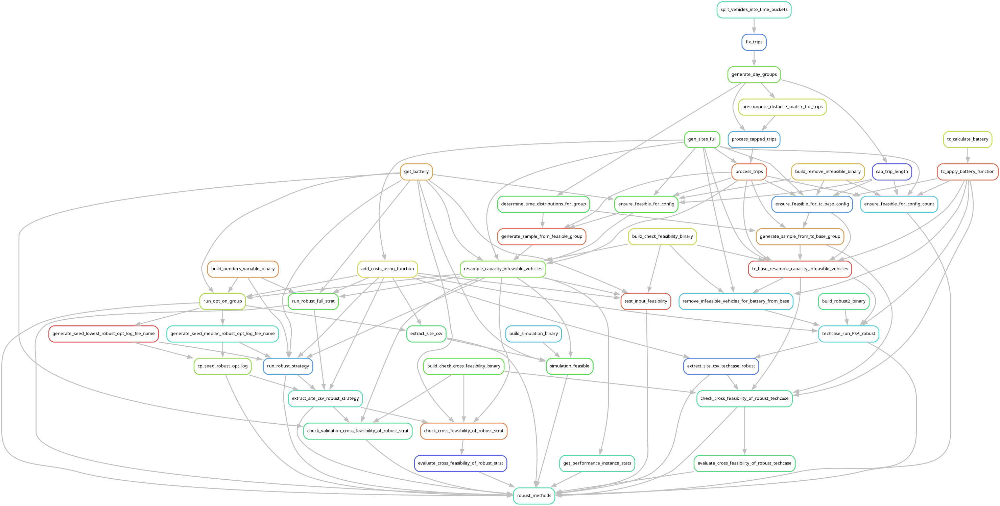

#  Robust Charging Network Planning for Metropolitan Taxi Fleets

This repository contains the code and preprocessing pipelines for the Paper CITE "Robust Charging Network Planning for Metropolitan Taxi Fleets".

## Architecture

The main optimization algorithm is implemented in Rust using Gurobi as a linear programming solver.
Processing of data is performed using Julia and Python scripts.
The entire process is end-to-end managed by the workflow engine [Snakemake](snakemake.readthedocs.io/).
External dependencies are version locked using Conda Environments and the Julia and Rust package managers.

> [!NOTE]  
> This is a snapshot of "research code" which is optimized for development velocity and flexibility.
> It contains technical debt, work-in-progress and loose ends that were not used in the final paper.

### Workflow - (Snakemake)

The primary `Snakefile` file specifies a workflow from raw input data to complete solutions.
All files regarding the Snakemake workflow can be found in the `pipeline` folder.
Executing `snakemake -c all -s Snakefile --use-conda` builds all solutions. Smaller subsets can be built by
providing file paths. Please see the Snakemake documentation for more details. Snakemake can automatically
generate snapshot unit tests on the job level.

We split the data processing workflow into many jobs to increase data caching, mix programming languages, and run the pipeline
in a batch processing cluster (SLURM). A full run of the workflow will spawn >40k jobs!

[Figure: Rule Graph of Snakemake Workflow](./doc/snakemake-rulegraph.png)

Note that computation times must be adjusted to include all (potentially cached) sub-tasks not considered preprocessing. This is especially relevant for the robust solution approaches.

### Optimization - (Rust & Gurobi)

The main optimization code is written in Rust. The Rust workspace and its dependencies are described in the Cargo.toml file.
Multiple entry points have been defined in the `src/bin/` folder. Each binary performs a single task, which is exposed via a CLI
interface. All relevant optimization parameters can be set using the CLI. Documentation is provided via the "--help" flag.

The file `column_generation/Cargo.toml` includes a variety of static feature toggles to influence behavior. Profiling instrumentation
is provided via the hawktrace library. The `shared` crate contains generic structs such as instance loading and battery calculations.

The main optimization functionality has been consolidated into the
binary `solution_approach_variable`, which is the main entry point for all optimization variants.
The file `cg_model.rs` contains the restricted master problem, `dag_builder.rs` the pricing problem graph,
`brancher.rs` the branching tree, and `solution_approach_variable.rs` the outer cutting plane algorithm and robust solution framework.
Note that some parts of the robust solution process, such as the selection of seed scenarios, are managed by the Snakemake Workflow.

### Data Processing - (Python & Julia)

The data processing scripts can be found in the subfolder `pipeline/preprocessing`.
They expose a CLI interface that will be called from the workflow runner.
Some of them are relatively trivial by design, as the fine granularity allows for better caching in the workflow.
The Python environment is defined by the `environment.yml`, while the Julia
environment is described by `Project.toml`.

Preprocessing requires the availability of an [OSRM Routing server](https://project-osrm.org/) to create the detour distance matrix
on real road network data.

## License - (GPL v3 or later)

This program is free software: you can redistribute it and/or modify
it under the terms of the GNU General Public License as published by
the Free Software Foundation, either version 3 of the License, or
(at your option) any later version.

This program is distributed in the hope that it will be useful,
but WITHOUT ANY WARRANTY; without even the implied warranty of
MERCHANTABILITY or FITNESS FOR A PARTICULAR PURPOSE.  See the
GNU General Public License for more details.

See the THIRDPARTY.yaml, Cargo.toml and Environment.yaml files for third-party license information.
